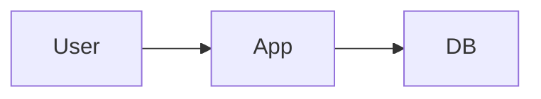

# Architecture Docs Creator

## Overview
Create a clear, opinionated ARCHITECTURE.md that explains the system design and constraints, then stop for approval before any implementation work.

## Workflow
1. Confirm scope and missing inputs.
   - Ask for missing stack details, constraints, integrations, and non-functional requirements.
   - If requirements are ambiguous, stop and ask for clarification before drafting.
2. Analyze the codebase or requirements.
   - Identify domains, existing boundaries, data stores, and cross-cutting concerns.
   - Note constraints imposed by existing infrastructure or tooling.
3. Design the architecture.
   - Choose a single architectural style and justify it.
   - Define modules/bounded contexts and their responsibilities.
4. Write ARCHITECTURE.md.
   - Use the template below and fill it fully.
   - Be direct and opinionated; include trade-offs and explicit prohibitions.
5. Stop and wait for approval.
   - Do not create or modify any other files until the user approves.

## ARCHITECTURE.md Template
Use this structure and keep it concise. Replace bracketed text.

# Architecture

## 1. System Overview
- Purpose and primary goals.
- Success criteria and non-goals.

## 2. Architectural Style
- Chosen style (e.g., Clean/Hexagonal, Layered + vertical slice).
- Why this style fits the requirements.

## 3. Domain Model and Modules
- Bounded contexts / domains.
- Responsibilities and ownership boundaries.

## 4. Directory Layout
- Top-level folders and responsibilities.
- Rules for where code must live.

## 5. Data Flow and Boundaries
- Key flows (request -> domain -> persistence -> response).
- Interfaces and boundaries between modules.

## 6. Cross-Cutting Concerns
- Authn/authz approach.
- Logging and observability.
- Error handling strategy.
- Configuration and secrets management.

## 7. Data and Integrations
- Datastores and schemas (high level).
- External services and integration patterns.

## 8. Deployment and Environments
- Runtime, hosting, and release strategy.
- Environments and configuration differences.

## 9. Key Design Decisions
- Decision list with brief rationale and trade-offs.

## 10. Diagrams (Mermaid)
- C4 level 1 (system context) and level 2 (containers).
- Component diagram for core modules if helpful.

## 11. Forbidden Patterns
- Explicit list of anti-patterns and things to never do.

## 12. Open Questions
- Items that require clarification or future decisions.

## Quality Bar
- Use strong defaults, not vague options.
- Prefer crisp bullets over long paragraphs.
- Record assumptions explicitly if you had to make them.
